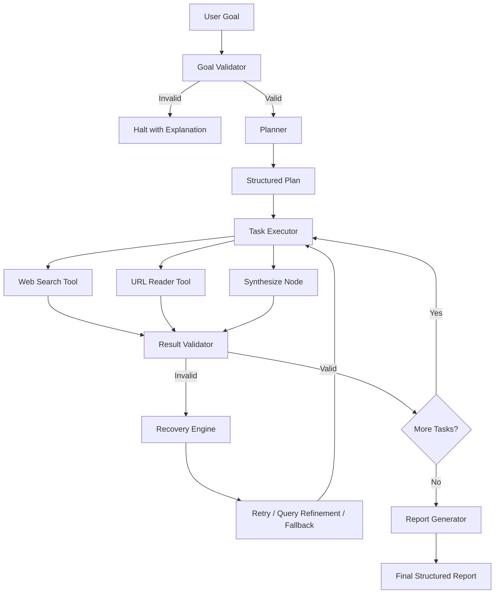

# ResearchPilot — Autonomous Research & Analysis Agent

ResearchPilot is an autonomous research and analysis system designed for the Agentic AI Engineer take-home assignment. It accepts high-level natural language goals, decomposes them into actionable tasks, invokes live tools, deterministically validates outputs, self-heals when failures occur, and synthesizes structured reports with full audit traces.

---

## 1. Problem Statement
Typical LLM chatbots act as single-turn text generators without agency: they cannot plan, invoke tools deterministically, inspect their own outputs, or recover from failed API calls. ResearchPilot demonstrates production-minded agentic behavior:

$$\text{Goal} \longrightarrow \text{Validate} \longrightarrow \text{Plan} \longrightarrow \text{Execute} \longrightarrow \text{Observe} \longrightarrow \text{Validate} \longrightarrow \text{Recover} \longrightarrow \text{Synthesize} \longrightarrow \text{Report}$$

---

## 2. High-Level Architecture



---

## 3. Agent Workflow & State Machine
1. **`validate_goal`**: Filters non-actionable input (e.g., `"hello"`, empty text) before wasting compute or API quota.
2. **`plan`**: Employs Gemini / deterministic schema to produce $\ge 2$ structured tasks using Pydantic.
3. **`execute_task`**: Executes the active step using the designated tool and logs invocation time.
4. **`validate_result`**: Deterministically verifies non-empty payloads, valid HTTP status codes, and minimum text lengths.
5. **`recover`**:
   - **Strategy 1 (Retry):** Retries up to 2 times with backoff.
   - **Strategy 2 (Query Refinement):** Expands keywords if search yields insufficient results.
   - **Strategy 3 (Source Fallback):** Automatically switches from Primary URL to Secondary/Fallback source.
   - **Strategy 4 (Replanning):** Advances gracefully after exhausting retry budgets.
6. **`generate_report`**: Compiles the executive summary, findings, deduped citations, and execution statistics.

---

## 4. Tools Included
1. **`web_search(query: str, simulate_failure: bool = False)`**:
   - Live web search with Tavily or DuckDuckGo backend.
   - Handles network timeouts and invalid URL sanitization.
   - Supports deterministic fault injection (`simulate_failure=True`).
2. **`read_url(url: str, simulate_failure: bool = False)`**:
   - HTTP fetching with custom headers and timeout boundaries.
   - HTML cleanup removing scripts, navigation, ads, and footers.
   - Enforces minimum content thresholds ($\ge 80$ characters).
3. **`synthesize(...)`**:
   - Synthesizes findings across gathered observations into structured conclusions.

---

## 5. Deliberate Failure Simulation
To reliably evaluate failure detection and autonomous self-healing without depending on sporadic internet outages:
- Turn the **"Simulate Failure"** toggle ON in the UI.
- The first tool call will deterministically simulate a service timeout (`HTTP 504 Gateway Timeout`).
- The agent catches the failure, logs the incident, triggers Retry #1, resets the fault boundary, and proceeds to success.

---

## 6. Installation & Setup

### Prerequisites
- Python 3.10+ (tested on Python 3.10, 3.11, 3.12)
- Virtual environment recommended

```bash
# Clone or navigate to project directory
cd researchpilot

# Create and activate virtual environment
python3 -m venv venv
source venv/bin/activate  # On Windows: venv\Scripts\activate

# Install dependencies
pip install -r requirements.txt
```

---

## 7. Environment Variables
Copy `.env.example` to `.env`:

```bash
cp .env.example .env
```

Configure your keys in `.env`:
```env
GEMINI_API_KEY=your_gemini_api_key_here
SEARCH_API_KEY=your_search_api_key_here  # Optional: Tavily or Serper
MAX_RETRIES=2
SIMULATE_FAILURE=false
```

*(Note: If no API keys are provided, ResearchPilot runs with its deterministic fallbacks for zero-setup evaluation!)*

---

## 8. Running the Application

Launch the Streamlit web dashboard:
```bash
streamlit run app.py
```
Open your browser to `http://localhost:8501`.

---

## 9. Running Tests

Run the full automated test suite:
```bash
pytest
```
Or with Python's built-in test runner:
```bash
python3 -m unittest discover -s tests
```

---

## 10. Example Inputs & Demonstration

### Demo 1 — Normal Research Run
- **Goal:** `"Research the latest developments in AI agents and identify three important trends."`
- **Behavior:** Validates goal $\to$ Decomposes into 3 tasks $\to$ Runs web search $\to$ Reads source URL $\to$ Synthesizes findings $\to$ Produces complete report with audit trace.

### Demo 2 — Deliberate Failure Recovery
- **Goal:** `"Research recent AI agent frameworks."`
- **Simulate Failure:** `ON`
- **Behavior:** Simulated timeout on Task #1 $\to$ Caught by validator $\to$ Trace updates $\to$ Self-healing retry activates $\to$ Live execution succeeds $\to$ Final report completed.

### Demo 3 — Edge Case (Invalid Input)
- **Goal:** `"hello"`
- **Behavior:** Validation node rejects goal with helpful instructions $\to$ Zero tool calls consumed $\to$ Clean termination.

---

## 11. Design Decisions
- **LangGraph State Graph:** Enables strict state boundaries and auditable execution traces rather than unpredictable monolithic prompts.
- **Pydantic Validation:** Guards task definitions, tool results, and final reports with schema guarantees.
- **Deterministic Fault Injection:** Allows evaluators to verify resilience in under 10 seconds.

---

## 12. Limitations
- JavaScript-heavy Single Page Applications (SPAs) require client-side execution not handled by standard HTTP requests.
- Public search APIs are subject to external rate limiting under heavy bursts.
- Transient state is stored per-session (no persistent PostgreSQL/Redis by design for this one-day scope).

---

## 13. Future Roadmap
1. Headless browser automation (Playwright).
2. Domain credibility and citation source ranking.
3. Human-in-the-loop confirmation gates for query refinement.
4. Parallel execution of independent sub-tasks.
