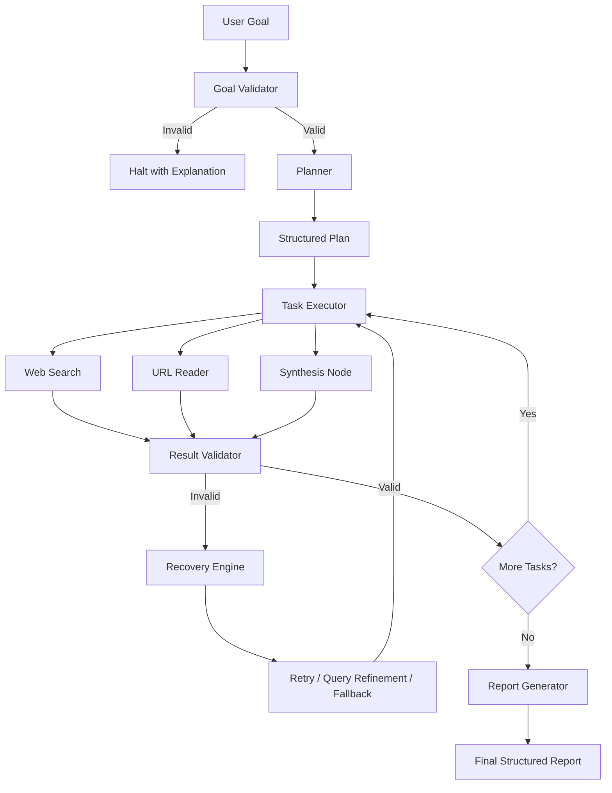

# ResearchPilot — System Architecture & Design Specification

## Overview
ResearchPilot is an autonomous research and analysis agent designed around an explicit state machine and deterministic recovery loop. It autonomously takes high-level research questions, plans sub-tasks, coordinates multiple tools, validates outputs, self-heals upon errors, and compiles structured analytical reports.

---

## 1. Architecture Flowchart

---

## 2. Core State Graph Nodes

| Node | Responsibility | Output Transitions |
| :--- | :--- | :--- |
| `validate_goal` | Validates semantic density, removes greetings/placeholders. | `plan` (if valid) or `END` (if invalid) |
| `plan` | Decomposes goal into >=2 structured tasks using Pydantic schema. | `execute_task` |
| `execute_task` | Resolves inputs, invokes target tool (`web_search`, `read_url`, `synthesize`), logs duration and trace. | `validate_result` |
| `validate_result` | Deterministically verifies output presence, length, and HTTP statuses. | `more_tasks?` (if valid) or `recover` (if invalid) |
| `recover` | Manages retry budget (`MAX_RETRIES=2`), query refinement, and fallback URL switching. | `execute_task` |
| `generate_report` | Aggregates observations, dedupes citations, computes metrics, and produces `FinalReport`. | `END` |

---

## 3. Key Design Decisions

- **Why LangGraph State Machine?**
  Monolithic ReAct loops easily become opaque and prone to hallucinated recovery steps. Explicit state machines decouple tool calling from transition logic, providing predictable state transitions, loop safety, and clean auditable trace logs.

- **Why Pydantic Models?**
  Strict typing guarantees that tool inputs, plans, and final reports conform to exact schemas, preventing runtime key errors across agent node boundaries.

- **Why Deterministic Validation?**
  LLM-only validation is expensive, slow, and subjective. ResearchPilot employs deterministic checks (HTTP status codes, minimum character thresholds, list lengths, regex) before falling back to semantic analysis.

- **Why Deterministic Failure Simulation?**
  To allow evaluators and automated test suites to reliably reproduce and verify the recovery flow without relying on intermittent external network drops.

- **Why Streamlit?**
  Keeps the project focused on agentic engineering, state control, and tool execution rather than frontend complexity.

---

## 4. Current Limitations

1. **JavaScript-heavy Pages:** Simple HTTP requests cannot execute client-side SPA JavaScript (e.g. React/Vue client rendered sites).
2. **Search API Quotas / Rate Limits:** Public search endpoints or DuckDuckGo HTML scraping can be throttled under high burst traffic.
3. **Transient Memory:** Agent state is retained for the execution session and not stored in persistent relational databases.
4. **No Parallel Execution:** Tasks run sequentially to preserve deterministic tracing in the single-day MVP.

---

## 5. Future Roadmap

1. **Headless Browser Execution:** Playwright integration for complex client-side rendered articles and PDF scraping.
2. **Source Quality & Credibility Scoring:** PageRank or domain reputation weighting.
3. **Human-in-the-Loop Checkpoints:** Interactive approval for query expansions or expensive deep-reads.
4. **Parallel Task Execution:** Concurrent tool fan-out across independent sub-tasks.
5. **Automated Citation Verification:** Cross-referencing synthesized claims directly with extracted character spans.
